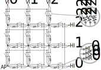

 

# Field Programmable Resistor Network

An analog layout for [Tiny Tapeout 7](https://tinytapeout.com/runs/tt07/)

[Read the documentation](docs/info.md)

[Get the bring-up presentation slides](docs/fprn-presentation.pdf)
